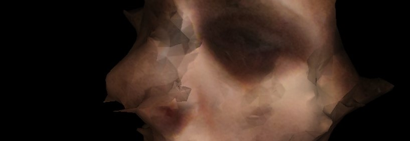
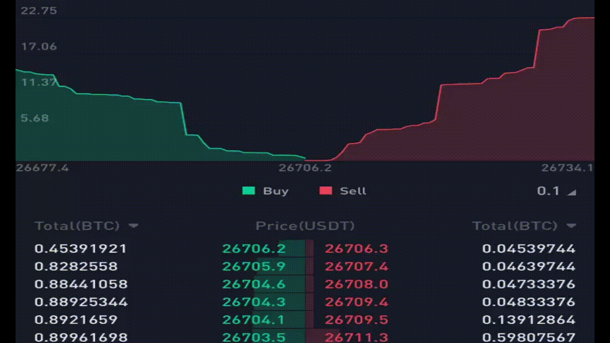
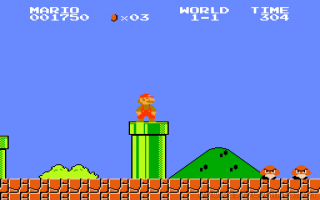
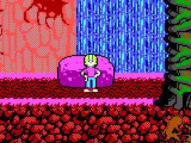
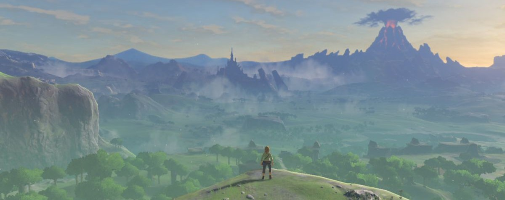

# design
<h3><i>elements &amp; philosophies</h3></i>

Most of my ideas on digital design can be found in these awesome articles: 
- <a href="https://density.substack.com/p/digitalnatural"> digital/natural</a>
-  <a href="https://density.substack.com/p/dense-imagery"> dense imagery</a>
-  <a href="https://density.substack.com/p/digital-expressionism"> digital expressionism</a>
-  <a href="https://density.substack.com/p/the-hierarchy-of-digital-art"> the hierarchy of digital art</a>

but I just wanted to sum up some other ideas more closely related to web design and game development.

<h3><i>digital expressionism</i></h3>
Stochastic elements in digital art are excellent expressive elements that most designers  
avoid out of habit. Data compression artifacts, dropped frames, reverbed sound, these are 
cardinal sins in the professional enviroment, but should be embraced by digital artists regardless.  

Implementing stochastic elements into web design is tricky because the form of programming 
neccessetates precision. Its not impossible though, in fact, it's probably one of  the keys to the universe,
and really seperates the tourists from the natives of the digital landscape.
   

<h3><i>design that breathes</i></h3>

Everything breathes. Injcting this breathe into design is an organic way to bring it to life. 
The order book of any typical crypto exchange app is a great example. The buys and sells cascade 
back and forth, moving markets regardless of the indiidual, its got a mind of its own, and a breathe too.  
A more classic example of design that breathes is the resting animation of Commander Keen 
compared to that of Mario's 8-bit iteration.

Mario sits static while Keen is active and dynamic even when you're not around.  
This simple animation gives the world a feeling like it exists beyond our interaction with it. 
Later iterations of Mario added resting animaitons, so nintendo seems to agree.

<h3><i>design that inspires</i></h3>

Meta's mission statement is about connecting users and bringing people together. Their products 
and services are very unobstructive in their design because of this. They stay out of your way, their subtle, they 
let the user's content shine. The minimal design there is inspires users to create their own content,  
at least in theory. Good design should always have this aim of inspiring new creation in mind, in my humble opinion. 

On the flip side, design can be bold and in your faace and be equally inspiring to the user's own creative endeavors. 
The vista's of nintendo's Breathe Of The Wild come to mind. Every design detail crafted with love with a bold 
style that's in your face all the time, in a good way. I'd live in Hyrule if I could.

